.. MIT License
   Copyright © 2018 Sig-I/O Automatisering / Mark Janssen, Licensed under the MIT license

Installing CentOS or RHEL
=========================

To install CentOS or RHEL we will need a system with at least the following resources:

* 64-bit CPU
* 1 GB of RAM
* 10 GB of diskspace
* Optical drive
* Ethernet network

While it's possible to install CentOS on smaller systems, this is not recommended. To complete all the exercises in this book, it's best to have a slightly larger system and keep some disk-space unpartitioned for later use. A system with 16GB or 32GB storage should be sufficient for most serious use. Getting extra memory or cpu-cores will make the system feel a lot faster and responsive, but these are not hard requirements.

Installation of CentOS and RHEL can be done from the installation CD/DVD, and optionally from a PXE-boot environment, usb-storage or various other methods. This book will describe the CD/DVD method initially, as this is the easiest and has the least requirements on the user and the environment.

.. sidebar:: Minimal Image

  If possible, don't use the minimal image, as this makes installation of CentOS a lot harder

CentOS iso images can be downloaded from one of the various mirrors available, which can be found on the CentOS.org website. CentOS comes in 3 [https://www.centos.org/download/] versions, a DVD image, a minimal image and *everything*. For a no-gui installation, the *minimal* image is sufficient, if you want a graphical invironment after installing CentOS, the *DVD* image is preferred. The *everything* image will normally not be needed if you have internet access on your system, as the needed packages
can be downloaded from the CentOS mirrors when needed. This image is also too large to be written to a DVD.

Red Hat Enterprise Linux installation images can be downloaded from the Redhat.com website if you have a subscription. You can register as a developer to gain access to the downloads and are allowed to run a single machine with RHEL for development and training purposes.

In cloud-environments
---------------------

In a cloud-environment you will usually get a pre-installed system when selecting CentOS from the available images. It's usually not possible to perform a manual installation. If you want to perform a manual installation, it's best to use a locally hosted virtual machine (qemu, virtualbox, parallels, vmware) or install on physical hardware.

Starting the installation
-------------------------

To install CentOS or RHEL, insert the CD/DVD or iso and boot the system from this installation media. The screenshots and description below will show the CentOS 7.5 version being installed, but this is mostly equivalent with installation of other CentOS 6.x, 7.x or (future) 8.x versions. The RHEL installation is equivalent, just with a different name and logo in the corner.

When you boot from the installation image, you will be greeted with this screen:

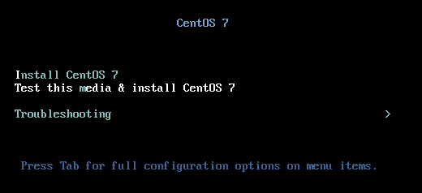

Select "Install CentOS 7" using the up-arrow, and press enter to continue. If you are not sure if your install-media is working correctly, you can choose the *Test this Media* option, which will do a verification of the bootable media. The rescue mode present on the installation image can be used for troubleshooting unbootable systems. This will be described in the chapter about troubleshooting. (FIXME: Reference)

When you have selected *Install CentOS 7*, the screen may flicker a while, some text should start scrolling by, indicating Linux is booting, and you should eventually end up in the Anaconda graphical installer on a screen that says 'Welcome to CentOS 7', and which will let you select a language to use for installation.

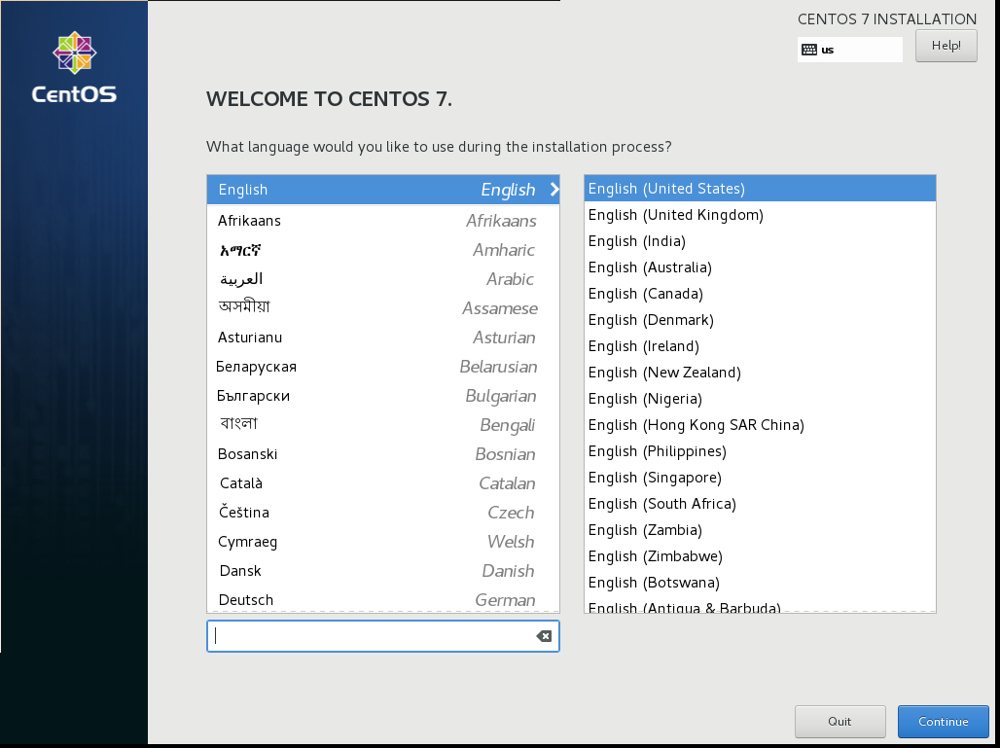

If you are not a native english speaker you may be tempted to install CentOS in your native language, however I would like to recommend that all installations should be done in English, as this will make it a lot easier to troubleshoot any installation and runtime issues. Searching the internet for english language error-messages will provide you with more and usually better results than localised versions. Besides that, various translations are rather incomplete or of limited
quality, resuling in a system with half english and half localised strings.

.. sidebar:: RHEL-8 Beta

   The RHEL8-Beta release uses the same screen as the CentOS 7.x and 6.x installer, however, the layout has changed from a vertical to a horizontal orientation.

After pressing enter, or selecting *Continue* with the mouse, you will be moved to the main installation-screen for CentOS or RHEL.

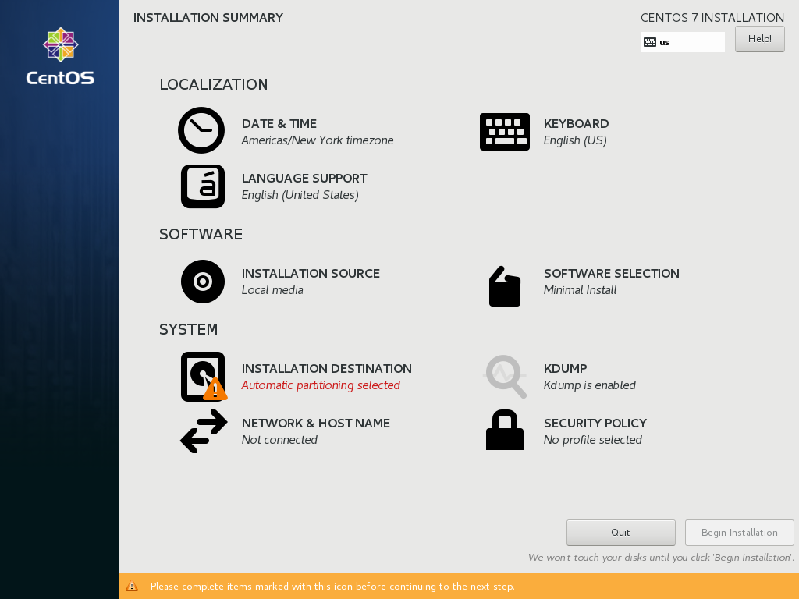

The installer will let you know which steps you have to (minimally) perform before starting installation by highlighting these tasks in red and displaying the warning icon.

The various sections of the installer are (in preferred order of configuring them):

Keyboard Configuration and Language Support
^^^^^^^^^^^^^^^^^^^^^^^^^^^^^^^^^^^^^^^^^^^

The Keyboard Configuration and Language Support tasks allow you to (re)configure language and keyboard settings. However, these tasks have already been completed in the previous screen. If you made any mistakes, or want to reconfigure keyboard or localization, you can do this here.

Network and Hostname
^^^^^^^^^^^^^^^^^^^^

The best task to start with in the installer is configuring the Network and Hostname. Doing this first will let you know quickly if your network is working, and allow you to configure your clock using a network-timeserver and install packages from external sources.

On selecting Network configuration, you will see your available network-cards and their present configuration

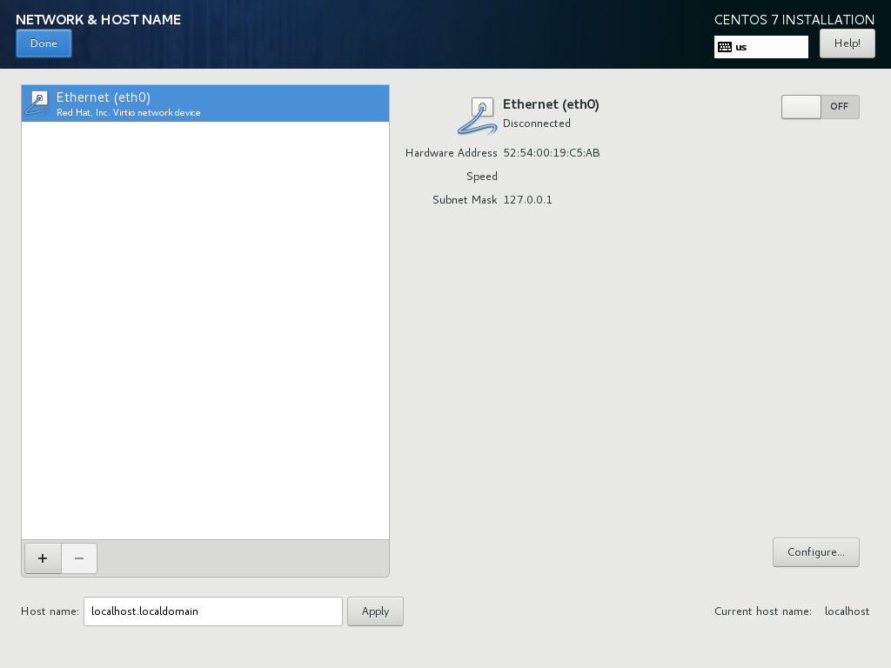

You can enter a fully-qualified-domain-name in the *Host name* field, for example: **centos7.example.com**, and then click *Apply* to activate this.

Select the primary network-interface (if you have more then one in the system). If you have a DHCP environment setup, you can move the ON/OFF slider to 'ON', and the network-card should configure itself. If you do not have a working DHCP environment, or if you want to configure a fixed IP-address or change some other network-related settings, click the *Configure* button.

When configuring the network-interface manually, you can enter the IP information in the following screen:

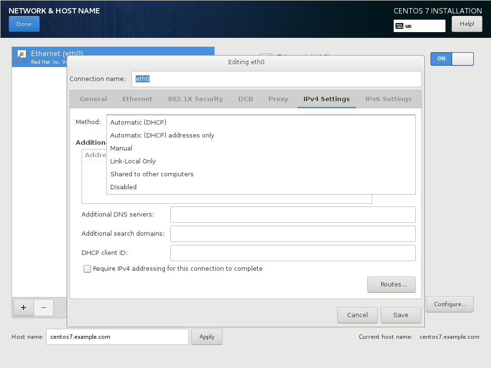

Selecting *Manual* under **IPv4 Settings** → **Method** will allow you to add one or more static IPv4 adresses. You can also configure things like custom routes, nameservers, IPv6 or wifi and 802.1x settings, but this is out of scope for the time being.

Date & Time
^^^^^^^^^^^

Under the *Date and Time* section, you can configure your system clock, set a timezone and configure NTP, the Network Time Protocol.

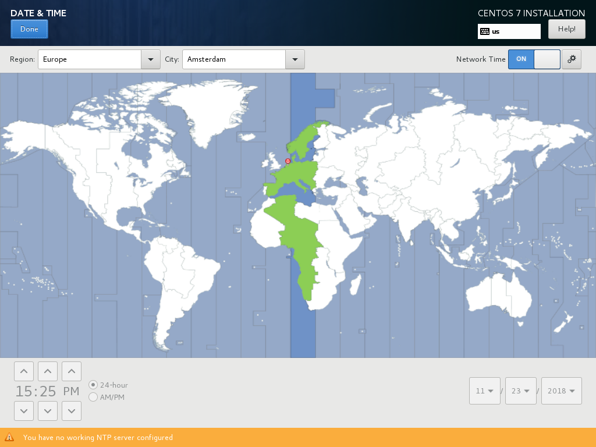

Select the correct timezone for where you are located, make sure that the *Network Time* slider is set to **ON** (This only works if you have first configured networking, and have internet-connectivity). Check that the system clock is set correctly and correct it if needed.

If you have a specific set of NTP servers you want to use, you can configure these specifically, otherwise the default centos ntp pool will be used.

Installation Source and Software Selection
^^^^^^^^^^^^^^^^^^^^^^^^^^^^^^^^^^^^^^^^^^

If you have booted from an *non-minimal* installation cd/dvd image, you don't need to (re)configure the software source. When you have used a *minimal*, you need to tell the installer where it can find the remaining software-packages that might be used in the installation. You can specify a location on a FTP or HTTP server or an NFS share that has a mirror of the CentOS packages. You need to specify the path to the architecture directory that contains the packages for your system, in
most cases this will be the *os/x86_64* directory.

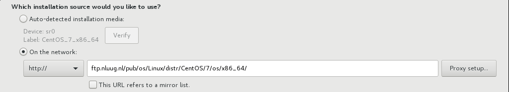

In this screenshot you can see a custom network-source used for installation, but if you have a dvd-install image, you can use this as a source by selecting (default) the *Auto detect installation media*, which in this case if the DVD image.

You can also add additional (local) software repositories which will be added to the system. It is however recommended to do most of this configuration after running the installer, and not from within the installer, as mistakes made in the installer are more difficult to correct.

The *Software Selection* screen allows you to choose which (groups of) packages you would like to install

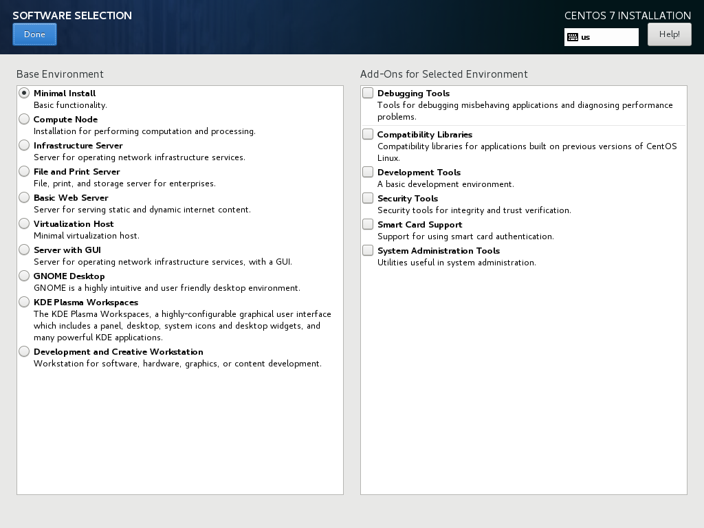

The basic recommended choices for software-selection are:

*Minimal Install*: This selection results in a minimal installation of CentOS, without any Graphical User Interface. This option is best suited for installation on cloud-instances or servers that will be configured further using configuration-management methods and tools like Ansible, Saltstack or Puppet.

*Virtualization Host*: Choose this option if this machine will primarily be used for running virtual machines on. You will get a system with KVM/Libvirt.

*Server with GUI*: Recommended for beginners, this selection gives you a server system that's also usable as a desktop/workstation with a graphical interface. For our first centos system, this would be a good choice. 

Please note that choices made in this screen do not limit your ability to later add other software or features to your system. This just determines which software will be installed by the installer and available at first boot.

If you just want to get the installation over as quick as possible, choose *minimal*. If you want a more complete desktop environment, choose *Server with GUI*

Installation Destination
^^^^^^^^^^^^^^^^^^^^^^^^
The *Installation Destination* specifies on which drive(s) you would like to install CentOS. If you have only a single drive in your system, this is easy, if you have multiple drives, you have some more options.

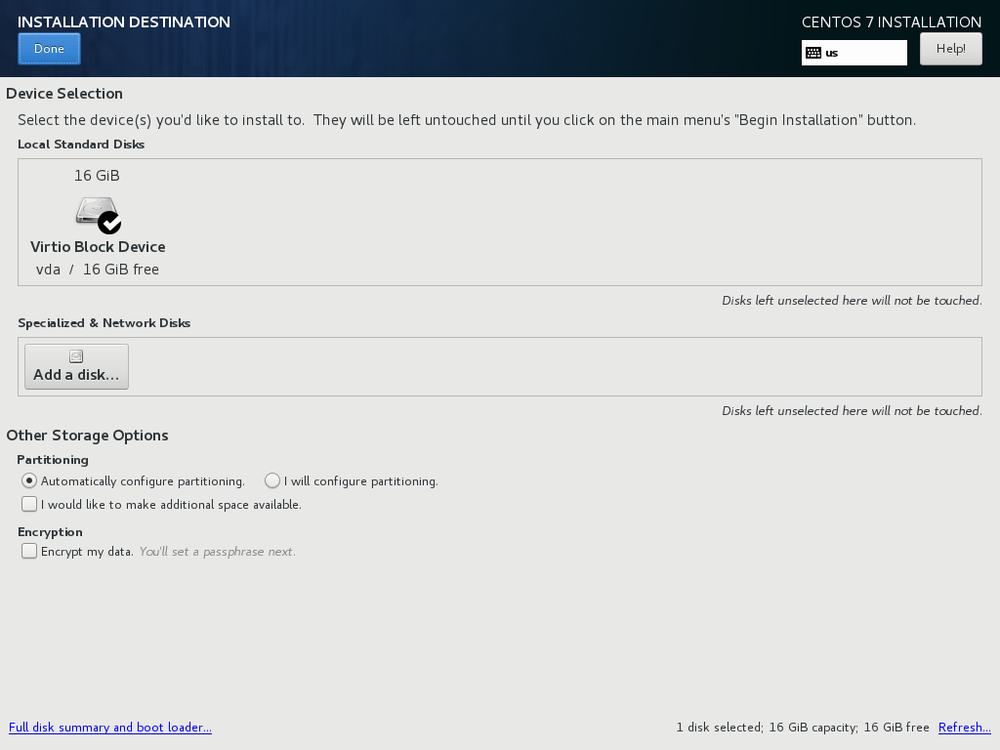

Your first drive will usually be called *sda*, or *vda* if you are running on a virtual-machine. If the installer detects multiple drives, these will also be listed. If you have an ISCSI SAN, luns (storage devices) from this SAN can be attached and configured with the *Add A Disk* button.

To install CentOS we can configure everything manually or let the installer configure your disk manually, it's also possible to change some options after selecting *Automatic configure partitioning* to tune the system to your liking.

*Encryption*: If you toggle the *Encrypt my data* option, CentOS will configure full-disk-encryption on your system. If you do this you will need to enter a disk-encryption password during installation and at every boot. For now we will not use encryption, but know that it is available and will prevent unauthenticated access to your data if enabled.

.. sidebar:: Quick-start

   If you just want to get going quickly, just select *Automatically configure partitioning* and hit *Done*

*Manual configuration*: If you want to get the best setup for your needs, select *Manual Configuration*, which will present you with the following screen:

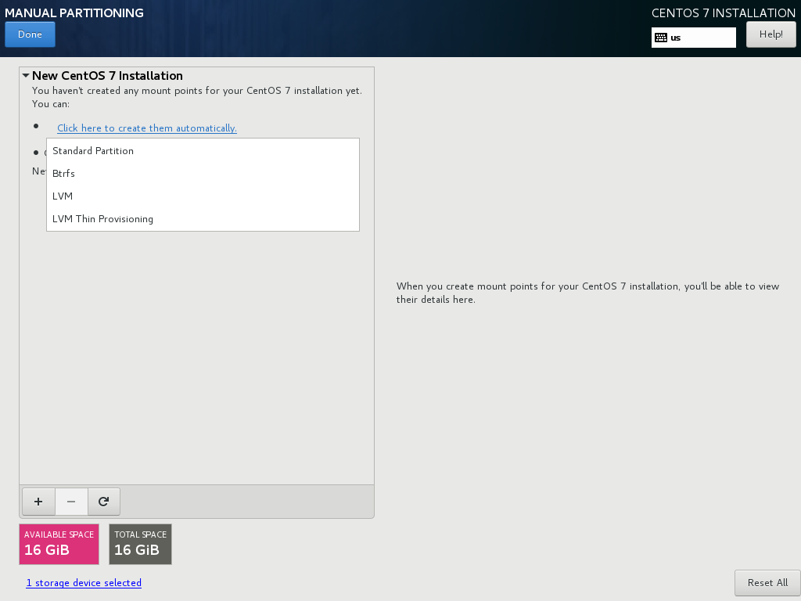

The CentOS installer can configure your partitions automatically at this point as well, but will allow you to make the required changes afterwards. THis is usually a quicker and easier method then starting from scratch. You can select between *Standard Partition*, *Btrfs*, *LVM*, or *LVM Thin Provisioning*. The default partitioning scheme is using *LVM*.

Standard Partition
""""""""""""""""""

Using *Standard Partition* will allow you to make up to 4 primary partitions, these are compatible with the partitioning used by Dos, Windows and other systems and supported by BIOS bases systems. Standard partitions are however quite limited in functionality and support only disks upto 2 TB.

LVM
"""

LVM is a modern partitioning scheme supported by Linux which allows for a virtually unlimited number of partitions and much flexibility when configuring your drives. It's the default choice for CentOS and RHEL version 6, 7 and 8.

LVM Thin Provisioning
"""""""""""""""""""""

This will use normal LVM partitioning, but allow you to create filesystems larger then the available disk-space (thin-provisioned). This only works as long as you are actually using less space than your disks provide.

Btrfs
"""""

This option is only available on CentOS 7.x and RHEL 7.x, as this partitioning method was introduced after CentOS 6.x became available. It's currently not recommended to use it, as support for it has been dropped again in RHEL 8.x, and it's only a *technical preview* feature in 7.x.

Creating the essential partitions
"""""""""""""""""""""""""""""""""

.. sidebar:: UEFI

   On UEFI systems you need to have or create an EFI System partition where Linux will place some files to allow your system to boot. On BIOS systems this is not needed. The installer will create the EFI partition for you if it detects you are running under UEFI.

The recommendation is to select *LVM* partitions, and then click the *Click here to create them automatically* button. This will configure the correct partitions for your system. You will then either see a */boot*, */*, and a *swap* partition listed, or, if running on an UEFI system, also an *EFI System Partition*. The screenshot below if from a BIOS system, so it doesn't have the EFI partition.

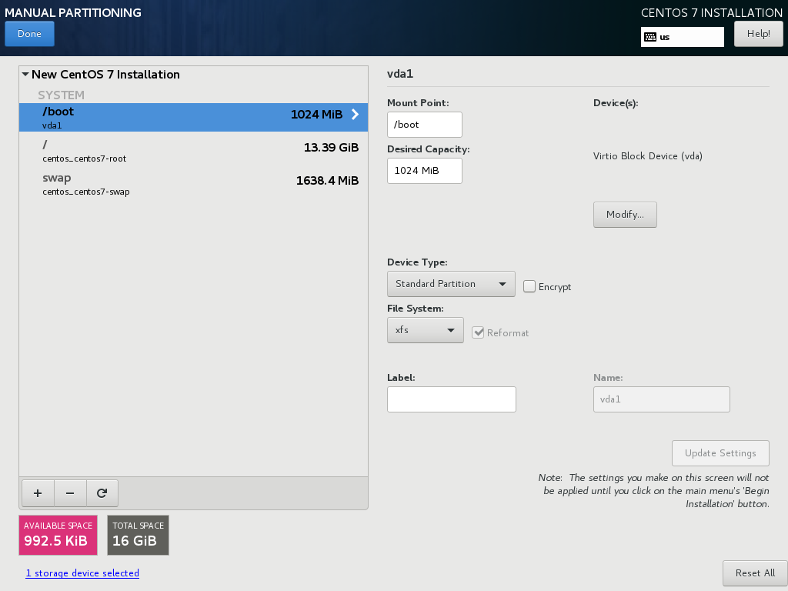

.. sidebar:: Swap space

   Swap space is used as temporary expansion space for application memory, when your system is in an *out of memory* situation. It's recommended to have at least 1 GB of swap-space, but going over 4 GB will usually be overkill, on some systems the installer will dedicate more diskspace to swapspace then to all other filesystems combined. This isn't very practical, so try to limit your swap to less then 8 GB maximum. If you later decide you need more swap-space, you can always add more
   when needed. You can also choose to go without swap completely, on some systems this is preferred.

The installer will choose sane defaults for the sizes of various partitions or filesystems, but you can change these settings if you need different settings on your system. If you have a lot of memory, it might be better to limit the amount of swap-space, as this might be a bit too large on some systems.

If you want to leave more space available for later use, you can change the sizes on the partitions by entering a new value in the *Desired Capacity* field, and hitting *Update Settings*. These are the values I will use:

* /boot: 512 MiB
* /: 10 GiB
* swap: 256 MiB

After making all your adjustment, hit the *Done* button. If there are any warnings these will be printed in a bar at the bottom of the screen.

If everything is correct, you will be shown a final confirmation screen with a summary of the changes that will be made to the system. If you click *Accept* now, the new partitioning will be made active and there is no easy way back from here.

After configuring the partitioning, you can normally continue with the installation, but for completion, we will describe the other available options in the installation screen first.

KDump
^^^^^

As the text on this screen describes, Kdump is a crash-dumping mechanism. This will reserve some system memory and disk-space to retain crash-dump information. This functionality is usaually not needed on most systems, so disable kdump and save yourself some memory and diskspace.

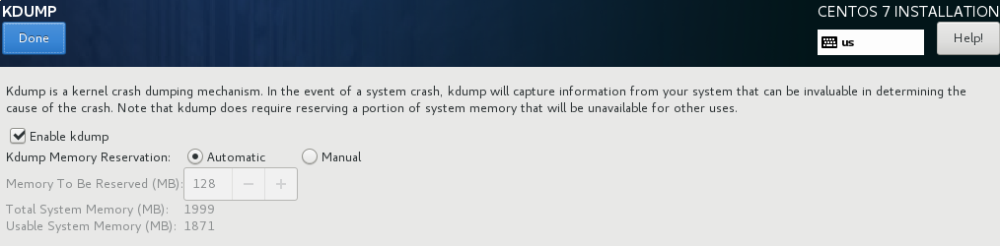

Security Policy
^^^^^^^^^^^^^^^

The last screen of the installer lets you select a *Security Policy*. For now, leave this unconfigured. Your system will come with *Security Enhanced Linux* (SELinux) configured and enabled by default.

Begin Installation
^^^^^^^^^^^^^^^^^^

After configuring at least all the sections marked in red, the *Begin Installation* button will be enabled. If you click this, the installation will start. Installation can take about 3-4 minutes when doing a minimal install, to about 10 minutes when installing a *Server with GUI* or other larger install (Depending on the speed of your system).

While the system is installing, you will be asked a few more questions, where you can configure passwords and an initial user-account.

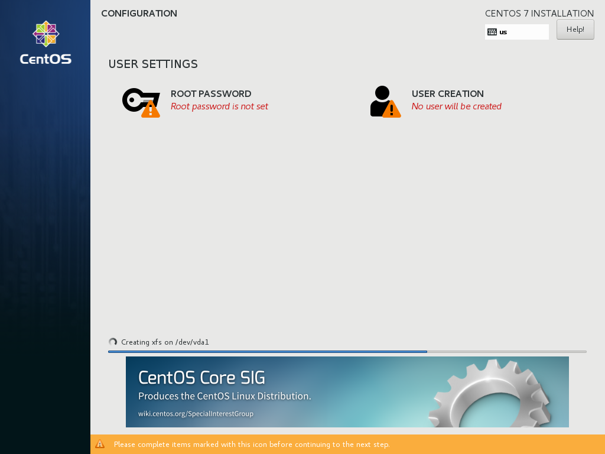

You should configure a *root password* at the very least. The installer will judge the password entered to make sure it's at least somewhat safe to use. For your root password you should choose a long and complex password, as this account gives ultimate access to the system and in normal use you will not need to enter this password often, as you should use a regular user-account for logging in.

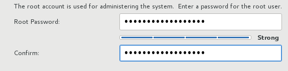

If the password is not complex enough, you will get another change to change it, or you can hit *Done* twice to use it anyway. If your system is just for testing and isn't internet-connected you could settle for an easy password here.

You can also (optionally) configure an initial user-account, this can be used to login to the system either locally or remotely (by default remote logins as root are not allowed).

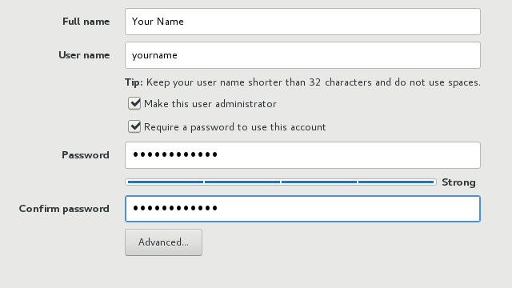

If you check the *Make this user administrator* box, this initial user-account will be added to the *wheel* group, allowing this user to become the *root* user using the *sudo* command and their own password. Don't enable this option for just any user though.

Finish Installation
^^^^^^^^^^^^^^^^^^^

If you entered the root-password and optionally created your initial useraccount, and the installation to disk is finished, the *Finish Installation* button will enable:

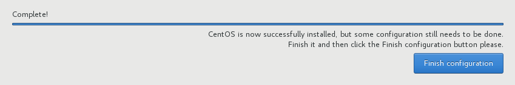

At this point, the installer will do some remaining tasks, like creating a ramdisk for booting (generating initramfs) and configuring your bootloader. When this is done, a *Reboot* button will be shown, allowing you to reboot your system into your newly installed CentOS system.

The system will reboot, and then should start from the internal drive and present you with a (grub) boot-menu. This will automatically start booting your installation in 5 seconds unless you interrupt the countdown by pressing space.

Grub will load your kernel and iniramfs and then continue starting Linux, eventually presenting you with either a graphical desktop (if you selected *Server with GUI*) or a text-based login-prompt.
