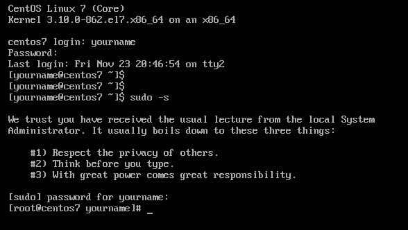

.. MIT License
   Copyright © 2018 Sig-I/O Automatisering / Mark Janssen, Licensed under the MIT license

Logging in and getting around with Linux
========================================

Now that we have a Linux system installed, we can login and start using it. If you have installed a Linux system without a GUI, you will be greeted by the 'login' program, running on a text-console. This will look somewhat like the following:

.. code-block:: none

  CentOS Linux 7 (Core)
  Kernel 3.10.0-862.el7.x86_64 on an x86_64

  centos7 login:

You can enter the username to your account, or use the *root* account. On the following password prompt, enter the password for the account, and you will be presented with a shell. Note that the text entered after the password prompt is not printed to the screen to prevent leaking your password to someone looking over your shoulder.

.. code-block:: none

  centos7 login: yourname
  Password:
  Last login: Sat Nov 24 12:34:56 on tty1
  [yourname@centos7 ~]$

If you specify an incorrect password, or if the useraccount you are trying to use doesn't actually exist, the system will only tell you *Login incorrect*, and present you with a new *login:* prompt. This is done so the system doesn't leak information about available accounts.

Becoming Root
-------------

For most system-administration tasks you will need to have root privileges. It's considered best-practice however to limit usage of the root account as much as possible. To reconsile these two statements, it's best to always login as yourself, and gain administrative privileges only when needed. You can for example use the **sudo -s** command to start a new shell as *root*, if you have sudo-permissions. Alternatively you can run single commands in the context of the root user by pre-pending
the command with sudo, for example:

.. code-block:: bash

  $ sudo id

.. sidebar:: First time using sudo

  The first time that you run sudo, you will be greeted with the text: *We trust you have received....*
  The next times you run sudo, it will only ask for your password. If you have run sudo successfully in the last 5 minutes (by default) you will not have to re-enter your password.

As you can see, after running the **sudo -s** command, the prompt has changed from *[yourname@centos7 ~]$* to *[root@centos7 yourname]#*. The prompt will always show you some critical information about who you are, where you are in the filesystem and if you are *root* or not.

.. index:: prompt, $PS1

The Prompt
----------

The first part of the prompt is your current username, in the example here *yourname*. Then, after the @ sign, is the hostname of the system you are currently logged in on. Since Linux systems are usually connected to over a network, and it's easy to hop from one system to another, it's really important to always have a visual indication on what system you currently are, to prevent you from doing something on the wrong system. The third bit of the prompt, here *~* initially and
*yourname* after the sudo command, tells you where you are in the filesystem. By default CentOS and RHEL put the name of the current directory in the prompt. Some other systems put the entire path here, which will result in a longer prompt if you are deep in a directory structure.

The last part of the prompt will usually be a '$' or '#' sign. Normal users will have a '$' sign, and the root-user will always have the '#' sign. In future examples, prompts will usually start with either an '$' or an '#' sign to indicate that the command should be run as regular user or as root.

Using the shell
---------------

When using Linux as a systems administrator you will be mostly working in the shell. The default shell used by most Linux distributions is *bash*, though other shells are available, other popular choices are for example *zsh* and *fish*. These shells are all focussed on interactive use, but there are also shells more focussed on usage in scripts, such ash dash or ash, which you can find in use on various Debian based scripts.

The shell is the main command interpreter that is started after logging in to a system. It's job is to read commands from the user, execute the commands either in the foreground or the background and then wait for a new command to be executed. The shell uses various environment variables which can influence what the shell does, or how it interprets the commands it's given.

The commands a shell interprets can be deviced in the following categories:

* Aliases
* Internal Commands
* External Commands

.. index:: aliases, alias

Aliases
^^^^^^^

An alias is basically a shortcut command, where the typed command is replaced by some other command which will be executed. This can for example be used to add specific options to existing commands, or to define a short command which executes something which would require typing a long and complex command.

.. code-block:: none
  :emphasize-lines: 1

  $ alias
  alias egrep='egrep --color=auto'
  alias fgrep='fgrep --color=auto'
  alias grep='grep --color=auto'
  alias l.='ls -d .* --color=auto'
  alias ll='ls -l --color=auto'
  alias ls='ls --color=auto'
  alias which='alias | /usr/bin/which --tty-only --read-alias --show-dot --show-tilde'

.. sidebar:: Aliases for the root user on CentOS and RHEL

  On these systems, the root user has a few default aliases, which replace the *rm*, *mv* and *cp* commands with aliases that include the *-i* option. This causes these commands to ask for confirmation before executing their respective tasks.

  This is done to help protect beginners from accidentally changing files on their system. When you are more comfortable in working with the shell it's suggested to remove these aliases.

On CentOS and RHEL systems various aliases are present in the default configuration, these can be inspected by typing the command *alias*. As you can see in the image above, there is an alias configured which says: **alias ll='ls -l --color=auto'**. 

This alias means that if you would enter the **ll** command, the shell would instead execute **ls -l --color=auto**. This also works if argument are given to the command, so running:

.. code-block:: bash

  $ ll /boot

would result in the shell actually running:

.. code-block:: bash

  $ ls -l --color=auto /boot

And in the shell you would then see something like the following (but with some file or directory names in various colors)

.. code-block:: none
  :emphasize-lines: 1

  [yourname@centos7 ~]$ ll /boot
  total 91224
  -rw-r--r--. 1 root root   147819 Apr 20  2018 config-3.10.0-862.el7.x86_64
  drwxr-xr-x. 3 root root       17 Nov 23 18:31 efi
  drwxr-xr-x. 2 root root       27 Nov 23 18:32 grub
  drwx------. 5 root root       97 Nov 23 18:44 grub2
  -rw-------. 1 root root 55392447 Nov 23 18:33 initramfs-0-rescue-677554f79ad949f09199a21f019d4613.img
  -rw-------. 1 root root 21692607 Nov 23 18:44 initramfs-3.10.0-862.el7.x86_64.img
  -rw-r--r--. 1 root root   304926 Apr 20  2018 symvers-3.10.0-862.el7.x86_64.gz
  -rw-------. 1 root root  3409143 Apr 20  2018 System.map-3.10.0-862.el7.x86_64
  -rwxr-xr-x. 1 root root  6224704 Nov 23 18:33 vmlinuz-0-rescue-677554f79ad949f09199a21f019d4613
  -rwxr-xr-x. 1 root root  6224704 Apr 20  2018 vmlinuz-3.10.0-862.el7.x86_64

You can define your own aliases with the **alias** command. These aliases will only work in the currently running shell session. To keep aliases for new shell invocations they need to be configured in your *profile* or *.bash.rc* file.

.. index:: builtins, alias, bg, cd, echo, exec, exit, export, false, fg, history, jobs, kill, pwd, read, set, source, test, true, ulimit, umask, unalias, unset, wait

Internal Commands
^^^^^^^^^^^^^^^^^

Internal commands are commands that are implemented as functions in the shell itself, and therefor do not have to be present as executables on the disk. Various shells have their own sets of internal commands, though some commands will always be implemented as internal commands. For the bash shell, you can find the list of built-in commands by looking at the *builtins* manual-page. The following list of built-in commands contains some often used internal commands:

=============   ===================================================
Builtin         Function
=============   ===================================================
alias           show or define aliases
bg              background a job
cd              Change directory
echo            Display contents of a variable
exec            Execute a command in place of the current shell
exit            Exit the current shell
export          Export a variable definition
false           Return a false value
fg              Take a background job back to the foreground
history         Look at commands entered before
jobs            Show jobs started by this shell
kill            Send signals to processes
pwd             Print current/working directory
read            Read input from the user
set             Change a setting
source          Read commands from a file
test            Execute a test
true            Return a true value
ulimit          Show or change resource limits
umask           Show or change filemasks
unalias         Unset aliases
unset           Unset settings
wait            Wait for a process to exit
=============   ===================================================

External Commands
^^^^^^^^^^^^^^^^^

The last group of commands are the *external commands*. These are basically all the other commands interpreted by the shell. External commands always refer to executable files or scripts present on the storage of the system. If the shell reads a command, it will first determine if the given command is an alias or internal-command and when this is not the case, it will search for the command on the filesystem.

The shell will not just scan the entire disk for possible commands, but will only look for locations specified in it's *PATH*. The *PATH* variable lists the various directories which are scanned in order for matching commands. If a command is present in multiple locations in the path, the first matched version will be executed.

You can inspect your current **PATH** variable using the built-in **echo** command. Shell variables are referenced using the variable-name prefixed with the **$** sign:

.. code-block:: bash
  :emphasize-lines: 1

  $ echo $PATH
  /usr/local/bin:/usr/bin:/usr/local/sbin:/usr/sbin:/home/yourname/ ...

Alternatively, you can inspect all shell variables with either the **set** builtin, or the **env** external command.

Note that the root user has different directories in their default PATH then non-root users, and every user is free to change their path temporarily of permanently to suit their needs. If you want to run a command that can be found on more then one location on the system, or that also exists as a builtin, you can run it by explicitly specifying it's full (or relative) path as part of the command. For example, here we first use the *builtin* **echo** command, and then the *external* **echo** command.

.. index:: echo

.. code-block:: bash
  :emphasize-lines: 1,3

  $ echo "Hello World"
  Hello World
  $ /bin/echo "Hello World"
  Hello World

If we specify the **--help** option to the commands, we can see that they respond differently based on this input:

.. code-block:: bash
  :emphasize-lines: 1,3

  $ echo --help
  --help
  $ /bin/echo --help
  Usage: /bin/echo [SHORT-OPTION]... [STRING]...
  or:  /bin/echo LONG-OPTION
  Echo the STRING(s) to standard output.
  ... (output snipped) ...

