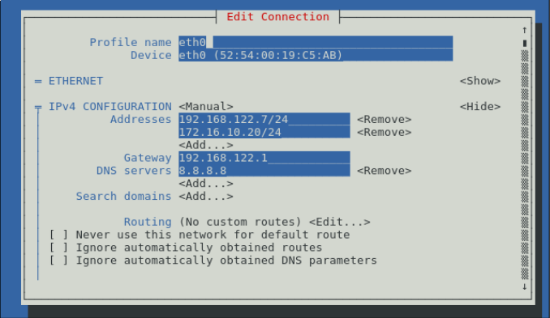
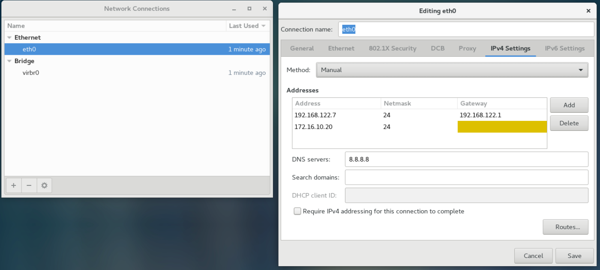

.. MIT License
   Copyright © 2018 Sig-I/O Automatisering / Mark Janssen, Licensed under the MIT license

IP Networking
=============

In this chapter we will look into network configuration in Linux, as systems without
network connection are very rare in this day and age. Networking in Linux consists of a
few seperate parts:

* Network card drivers
* IP address configuration
* Routing
* Firewalls and security features

Network types
-------------

These days, almost all networks you will encounter will be :abbr:`IP (Internet Protocol)`
based networks, but Linux also has support for various other older and exotic networking
protocols. In this book we will only be talking about :abbr:`IP (Internet Protocol)`
networks, as this fits the scope for LPI and RHCSA certifications, and what you will use
daily.

Looking further at networking on modern systems, we can look at wired and wireless
networking, with wireless further split into cellular and WiFi-based networks. In general,
Linux supports almost all network-interfaces out of the box, as network-chip manufacturers
usually work with the Linux kernel community to get support for new devices built in
quickly. Only very occasionally you will encounter a network-card (mostly wifi-based) that
will not work under Linux out of the box.

Addressing
----------

The two commonly used network protocols currently are :abbr:`IPv4 (Internet Protocol
version 4)` and :abbr:`IPv6 (Internet Protocol version 6)`. IPv4 is the *original*
protocol of the internet, and practically all systems will have an IPv4 address.

IPv4 addresses are presented (for human use) as 4 decimal 8-bit numbers, seperated by
dots. An IPv4 address is 32-bits in total, which limits the number of unique addresses to
2^32, which is slightly over 4 billion.

Example IPv4 addresses

.. hlist::
   :columns: 4

   * 10.20.30.40
   * 172.16.17.18
   * 188.40.154.15
   * 255.255.255.255

Many systems will also have IPv6 addresses, as the number of available IPv4 addresses was
quickly running out. IPv6 addresses are 128-bits in size, and are printed as 8 groups of
4 hexadecimal digits seperated with semicolons.

Example IPv6 addresses

.. hlist::
   :columns: 2

   * 2001:0470:7f95:0000:4e6c:ec8e:0ba1:694b
   * 2a00:1450:400e:080c:0000:0000:0000:200e
   * fe80:0000:0000:0000:b0f6:2f66:af28:86a2
   * 2001:0888:0000:0018:0000:0000:0000:0080

.. sidebar:: Hexadecimal

  In the hexadecimal (16-numbered) counting system, we use the digits 0 through 9, and the
  letters 'a' through 'f'. Hexadecimal is used a lot with computer-systems, as it is a
  short notation which can be quickly converted to binary, which would be a lot more
  difficult to read correctly for humans. Every hexadecimal digit can represent 16 values,
  which map directly to 4 binary digits.

  .. tabularcolumns:: |L|L|R|
  .. csv-table:: Decimal, Hexadecimal and Binary
    :header: "Dec", "Hex", "Bin"

    0,0,0
    1,1,1
    2,2,10
    3,3,11
    4,4,100
    5,5,101
    6,6,110
    7,7,111
    8,8,1000
    9,9,1001
    10,A,1010
    11,B,1011
    12,C,1100
    13,D,1101
    14,E,1110
    15,F,1111

Since these addresses are quite long, a shorter notation is also allowed, as long as this
shorter notation can be converted back consitently. In this notation, leading zeros in
blocks can be removed, so:

2001:0888:0000:0018:0000:0000:0000:0080

would become:

2001:888:0:18:0:0:0:80

Furthermore, repeated blocks of only zero's can be removed and replaced with 2 colons.
However, this can only be done once, otherwise it wouldn't be clear how many zeros should
be inserted here. Using this method, the above address is further shortened to:

2001:888:0:18::80

This is the format as seen from the various Linux commands.

Ad-Hoc Network Configuration
----------------------------

You can configure your network using various generic commands, which you will find in any
Linux distribution. This configuration will be ad-hoc and will not survive reboots, but
it's important to know how to configure a network manually. Doing manual configuration
allows you to quickly try out various settings, see if networking works and prepare you
for configuring permanent settings.

To configure the permanent networking-settings, various Linux distributions have their own
tools and/or configuration-files, so these methods are described in the following
sections.

Classic network configuration tools
-----------------------------------

First we will document the classic network-configuration commands:
* ifconfig
* route
* netstat

On many newer systems these will no longer be present in the default installs, but they
are still available as optional addons.

ifconfig
^^^^^^^^

The :file:`ifconfig` tool, present in most (older) Linux distributions, and also in many other
Unix-like systems, has been the go-to tool for network-configuration for a long time.
These days it has mostly been replaced with :file:`ip` from the *iproute2* package, documented below.

Just running :file:`ifconfig` will show you all currently configured network-cards and
their networking-configuration, traffic counters and some hardware information.

.. code-block:: none
  :caption: Running ifconfig
  :emphasize-lines: 1

  $ ifconfig
  eth0: flags=4099<UP,BROADCAST,MULTICAST>  mtu 1500
        ether 8c:20:30:3f:ba:af  txqueuelen 1000  (Ethernet)
        RX packets 2236119  bytes 1102568897 (1.0 GiB)
        RX errors 5506  dropped 30255  overruns 0  frame 2753
        TX packets 291221  bytes 32254234 (30.7 MiB)
        TX errors 0  dropped 0 overruns 0  carrier 0  collisions 0
        device interrupt 16  memory 0xf2100000-f2120000  

  lo: flags=73<UP,LOOPBACK,RUNNING>  mtu 65536
        inet 127.0.0.1  netmask 255.0.0.0
        inet6 ::1  prefixlen 128  scopeid 0x10<host>
        loop  txqueuelen 1  (Local Loopback)
        RX packets 7243979  bytes 4942978708 (4.6 GiB)
        RX errors 0  dropped 0  overruns 0  frame 0
        TX packets 7243979  bytes 4942978708 (4.6 GiB)
        TX errors 0  dropped 0 overruns 0  carrier 0  collisions 0

  wlan0: flags=4163<UP,BROADCAST,RUNNING,MULTICAST>  mtu 1500
        inet 100.64.0.51  netmask 255.255.255.0  broadcast 100.64.0.255
        inet6 2001:22:44ba:129c:6c:c8e:ba1:694b  prefixlen 64  scopeid 0x0<global>
        inet6 fe80::b0f6:2f66:af28:86a2  prefixlen 64  scopeid 0x20<link>
        ether 34:41:5d:12:34:56  txqueuelen 1000  (Ethernet)
        RX packets 60594152  bytes 36266491981 (33.7 GiB)
        RX errors 0  dropped 2  overruns 0  frame 0
        TX packets 19387955  bytes 4314958458 (4.0 GiB)
        TX errors 0  dropped 0 overruns 0  carrier 0  collisions 0

You can also modify the network-configuration by specifying the configuration as arguments
to :file:`ifconfig`. For example. to configure **eth0** with ip-address *10.20.30.40* and
netmask *255.255.255.0*, you can run:

.. code-block:: none
  :caption: Running ifconfig
  :emphasize-lines: 1,2

  # ifconfig eth0 10.20.30.40 netmask 255.255.255.0
  # ifconfig eth0
  eth0: flags=4099<UP,BROADCAST,MULTICAST>  mtu 1500
        inet 10.20.30.40  netmask 255.255.255.0  broadcast 10.20.30.255
  ...

route
^^^^^

Using the :file:`route` command you can inspect and make changes to the default kernel
routing table.

.. code-block:: none
  :caption: Viewing the default routing table with route
  :emphasize-lines: 1

  $ route -n
  Kernel IP routing table
  Destination     Gateway         Genmask         Flags Metric Ref    Use Iface
  0.0.0.0         100.64.0.1      0.0.0.0         UG    600    0        0 wlan0
  10.20.30.0      0.0.0.0         255.255.255.0   U     0      0        0 eth0
  100.64.0.0      0.0.0.0         255.255.255.0   U     600    0        0 wlan0

Routes can be added or removed as well

.. code-block:: none
  :caption: Viewing the default routing table with route
  :emphasize-lines: 1,2,3

  # route add -net 10.50.60.0/24 gw 10.20.30.254 dev eth0
  # route add -host 10.60.70.80 gw 10.20.30.254
  # route
  Kernel IP routing table
  Destination     Gateway         Genmask         Flags Metric Ref    Use Iface
  default         gateway         0.0.0.0         UG    600    0        0 wlan0
  10.20.30.0      0.0.0.0         255.255.255.0   U     0      0        0 eth0
  10.50.60.0      10.20.30.254    255.255.255.0   UG    0      0        0 eth0
  10.60.70.80     10.20.30.254    255.255.255.255 UGH   0      0        0 eth0
  100.64.0.0      0.0.0.0         255.255.255.0   U     600    0        0 wlan0

Removal is the same, but with **del** instead of **add**

netstat
^^^^^^^

The :file:`netstat` command lets you inspect various related settings, like open network
connections. See the man-page of netstat for description of its many options.

.. code-block:: none
  :caption: Showing open tcp ports and connections using netstat
  :emphasize-lines: 1

  # netstat -tlpn
  Active Internet connections (only servers)
  Proto Recv-Q Send-Q Local Address           Foreign Address         State       PID/Program name    
  tcp        0      0 127.0.0.1:2025          0.0.0.0:*               LISTEN      11407/ssh           
  tcp        0      0 127.0.0.1:3306          0.0.0.0:*               LISTEN      1186/mysqld         
  tcp        0      0 0.0.0.0:22              0.0.0.0:*               LISTEN      18930/sshd          
  tcp        0      0 127.0.0.1:631           0.0.0.0:*               LISTEN      3633/cupsd          
  tcp        0      0 127.0.0.1:25            0.0.0.0:*               LISTEN      1769/master         
  tcp6       0      0 :::22                   :::*                    LISTEN      18930/sshd          
  tcp6       0      0 ::1:631                 :::*                    LISTEN      3633/cupsd          
  tcp6       0      0 ::1:25                  :::*                    LISTEN      1769/master         

iproute2
--------

IPRoute2 is the newer set of network-configuration tools available on the Linux commandline.
The main command is :file:`ip`, which is a very flexible command, as it allows you to configure
ip-addresses, routes, arp-entries, tunnels and various other network related settings. This
flexibility makes the :file:`ip` command a but more complex to use though.

:file:`ip` uses the concept of objects and commands, first you specify what *object* you want to
work with, then what task you want to perform, the *command*, and then the options specifying what
you would like to do or change on this object. The **help** command can be used at many places and
levels to give you information about what **ip** expects at that point.

These days :file:`ip` is preferred, since it will handle ipv4 and ipv6 configuration using the same
syntax and methods. You can also abbreviate all commands and options to the shortest unique string
that matches the command or option you need, so **ip -4 a a 1.2.3.4/32 dev eth0** is equivalent to
**ip -4 address add 1.2.3.4/32 dev eth0**

Various 'objects' you can work with include:
* address: An IPv4 or IPv6 address on a device
* link: The state of a network device
* neighbour: ARP and IPv6 Neighbour discovery entries
* netns: Networking namespaces
* route: Routing
* rule: Rule-based routing
* tunnel: IP Tunnels
* tuntap: Tun or Tap devices

.. code-block:: none
  :caption: Configuring IPv4 and IPv6 addresses using iproute2
  :emphasize-lines: 1,2,3

  # ip -4 addr add 10.20.30.100/32 dev eth0
  # ip -6 addr add 2001:22:44ba:129c::10/64 dev eth0
  # ip -6 a sh dev eth0
  2: eth0: <NO-CARRIER,BROADCAST,MULTICAST,UP> mtu 1500 state DOWN qlen 1000
      inet6 2001:22:44ba:129c::10/64 scope global tentative 
         valid_lft forever preferred_lft forever

Network Configuration in CentOS
-------------------------------

CentOS and RHEL have multiple methods to configure network settings, you can use
* nmcli
* nmtui
* nm-connection-editor (Gnome GUI)

These 3 different methods, a CLI based tool (nmcli), a curses text-windows interface (nmtui)
and the GUI (nm-connection-editor), all work with and from the same configuration-files, which
are plain-text files stored in */etc/sysconfig/network-scripts/*.

This means that it's also possible to just change these files with your favorite text-editor or
configuration-management tools.

nmcli
^^^^^

nmcli, the network-manager command-line-interface, is the least user-friendly tool of the bunch,
as using it involves lots of typing, checking help-entries and copy/pasting unique identifiers. Unless
you want to do some advanced automated configuration, I suggest to stay away from this tool as much
as possible, almost anything you will actually use can be done from the configuration-file, using nmtui
and nm-connection-editor.

nmtui
^^^^^

For basic network-configuration, nmtui will get the job done, though the text-user-interface might take
some getting used to. You can navigate to fields using the arrow-buttons or *tab* and *shift+tab*

When staring nmtui, you have 3 options available:
* Edit a connection, used to configure a device
* Activate a connection, to start the configured network
* Set system hostname, to change the hostname

Under *Edit a connection* you can choose from the available network-devices, or add a new network-device
if this isn't configured or detected yet. Normally your first network-card will be called *eth0*.

If you select *Edit*, you can configure the network-settings for the chosen device:

nm-connection-editor
^^^^^^^^^^^^^^^^^^^^

If you are on a system with the GUI installed, you can (as root) run **nm-connection-editor**, which will
show you the following interface, from which you can configure your networking.

configuration files
^^^^^^^^^^^^^^^^^^^

As stated previously, all changes made using the various configuration-tools just result
in changes in the configuration-files that are actually used for network-configuration.
These files can be found in **/etc/sysconfig/network-scripts/**. For example, the
configuration for the **eth** interface will be in the
:file:`/etc/sysconfig/network-scripts/ifcfg-eth0`. file.

.. sidebar:: Debian

  On debian systems, nm-cli, nm-tui and nm-connection-editor are also available, but
  save their configurations in various files in :file:`/etc/NetworkManager/system-connections`
  while the normal debian-method saves configuration in :file:`/etc/network/interfaces`.

.. code-block:: none
  :caption: Contents of ifcfg-eth0
  :emphasize-lines: 1

  # cat /etc/sysconfig/network-scripts/ifcfg-eth0
  TYPE=Ethernet
  BOOTPROTO="static"
  DEFROUTE=yes
  NAME=eth0
  DEVICE=eth0
  ONBOOT=yes
  PROXY_METHOD=none
  BROWSER_ONLY=no
  IPADDR=192.168.122.7
  PREFIX=24
  GATEWAY=192.168.122.1
  DNS1=8.8.8.8
  IPV4_FAILURE_FATAL=no
  IPV6INIT=no
  UUID=5fb06bd0-0bb0-7ffb-45f1-d6edd65f3e03
  IPADDR1=172.16.10.20
  PREFIX1=24

As can be seen here, the configured IP-addres can be found under the **IPADDR** variable,
and other related networking values under **PREFIX** and **GATEWAY**. The secondary (and further)
addresses will have a number appended, so **ADDRESS1**, **PREFIX1**, **GATEWAY1**, etcetera.

You can enable and disable network-interface configurations using **ifup eth0** and
**ifdown eth0**.

Network Configuration in Debian/Ubuntu
--------------------------------------

In debian, the network-manager interfaces named before are also available, but on systems
with wired networks these tools are almost never used. Debian's preferred method of
network-configuration is from the :file:`/etc/network/interfaces` file, or a file in the
:file:`/etc/network/interfaces.d/` directory.

.. code-block:: none
  :caption: Contents of ifcfg-eth0
  :linenos:
  :emphasize-lines: 1

  $ cat /etc/network/interfaces 
  # This file describes the network interfaces available on your system/interfaces 
  # and how to activate them. For more information, see interfaces(5).

  source /etc/network/interfaces.d/*

  # The loopback network interface
  auto lo
  iface lo inet loopback

  auto ens3
  iface ens3 inet static
    address 192.168.122.9
    netmask 255.255.255.0
    gateway 192.168.122.1

In the configuration above, you can see Debian's default network-configuration. In line 4
we see the *source* statement, which includes all files in
:file:`/etc/network/interfaces.d/`, which is a directory where you can add more
configuration files for networking.

In line 8 and 11, **auto <interface>** means that this interface will be brought online
during booting.

Line 9 configures the loopback interface, which only has the default configuration. Line
12-14 configure the ens3 interface with the specified ip-address, netmask and gateway.

The :file:`/etc/network/interfaces` file supports many options and
configuration-directives for various networking features, such as vlan's, secondary
ip-addresses, routes, dhcp-options and commands to be run before or after bringing up the
network-interface. The *interfaces(5)* man-page documents all the available options.

To activate or deactivate an interface, you can run **ifup <interface>** or **ifdown**,
both of which also take the **-a** argument, to act on all interfaces.
