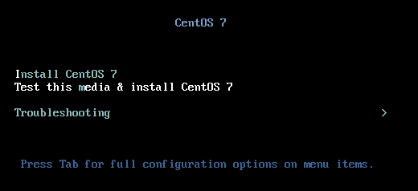

.. MIT License
   Copyright © 2018 Sig-I/O Automatisering / Mark Janssen, Licensed under the MIT license

User Management
===============

The Linux permission system is based on the concept of users and groups. Every file on the
system is owned by a user and group combination, every running process runs with a specific
user and group permission.

The /etc/passwd file
----------------------

Local useraccounts are stored in the :file:`/etc/passwd` file. This is the traditional
password file for UNIX and Linux accounts. The :file:`/etc/passwd` file doesn't actually
contain the (encrypted) passwords anymore these days, as these are stored in
:file:`/etc/shadow`, but passwords were stored here originally, and you could actually
still put passwords in the :file:`/etc/passwd` file, though this is highly discouraged, as
this file is world-readably, and this would give everyone access to the encrypted
passwords.

The :file:`/etc/passwd` file consists of various fields, seperated by semicolons (*:*),
with one user per line. The file-format is documented in the *passwd(5)* manual-page, and
consists of the following fields (in this order):

* login name: The username for the user, which should be lowercase, and preferably not too
  long.

* password: This field used to hold the password originally, these days the field will
  either contain an asterisk (*) or the letter 'x'. The letter 'x' tells the system that
  the password for this user should be read from the :file:`/etc/shadow` file. The '*'
  character is used to disable password-authentication for this account.

* uid: The user identification number, a (preferably) unique number that denotes this
  user. For normal users, this number should be above the value of UID_MIN, which is
  normally *1000*. The UID_MIN, UID_MAX (and other) values can be found in the
  :file:`/etc/login.defs` file.

* gid: The primary group number for the user, which referenced the group entry from the
  :file:`/etc/group` file, which we will discuss below.

* :abbr:`gecos (General Electric Comprehensive Operating System)`: The GECOS (or comment)
  field is used to put human-readable information about the user, usually at least the
  full name and somethings things like phone- and room-numbers. The information in this
  field will be used by the **finger(1)** command.

* directory: The home-directory for the user, the initial directory where the user is
  placed after logging in, and where the system will look for various configuration-files
  for this user. This will also be the location the :envvar:`HOME` variable points to for
  this user.

* shell: Which shell should be started when the user logs in. If no shell is specified,
  :file:`/bin/sh` will be started. If this field is set to a not-existing filename, the
  user will not be able to login, but to specifically enforce this, :file:`/sbin/nologin`
  is used in general, though you might also find :file:`/bin/false` used for this.

During the installation, at least one useraccount will usually be created, we'll use this
entry as the example here:

.. code-block:: none
  :caption: A password-file entry
  :name: passwd-entry

  yourname:x:1000:1000:Your Name:/home/yourname:/bin/bash

.. seealso:: See Also here

.. todo:: Something todo

.. warning:: A Warning

.. note:: Beware of this note

.. sidebar:: Minimal Image

  If possible, don't use the minimal image, as this makes installation of CentOS a lot harder

  

.. code-block:: bash
  :emphasize-lines: 1

  $ alias
